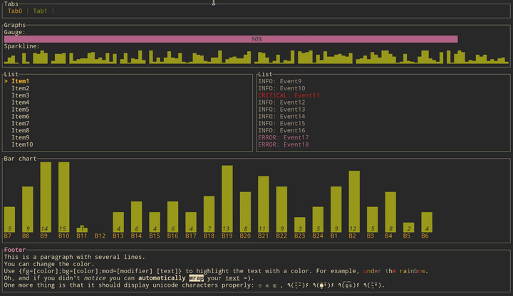

# tui-rs

[](https://github.com/fdehau/tui-rs/actions?query=workflow%3ACI+)
[](https://crates.io/crates/tui)
[](https://docs.rs/crate/tui/)



`tui-rs` is a [Rust](https://www.rust-lang.org) library to build rich terminal
user interfaces and dashboards. It is heavily inspired by the `Javascript`
library [blessed-contrib](https://github.com/yaronn/blessed-contrib) and the
`Go` library [termui](https://github.com/gizak/termui).

The library supports multiple backends:
  - [crossterm](https://github.com/crossterm-rs/crossterm) [default]
  - [termion](https://github.com/ticki/termion)

The library is based on the principle of immediate rendering with intermediate
buffers. This means that at each new frame you should build all widgets that are
supposed to be part of the UI. While providing a great flexibility for rich and
interactive UI, this may introduce overhead for highly dynamic content. So, the
implementation try to minimize the number of ansi escapes sequences generated to
draw the updated UI. In practice, given the speed of `Rust` the overhead rather
comes from the terminal emulator than the library itself.

Moreover, the library does not provide any input handling nor any event system and
you may rely on the previously cited libraries to achieve such features.

**I'm actively looking for help maintaining this crate. See [this issue](https://github.com/fdehau/tui-rs/issues/654)**

### Rust version requirements

Since version 0.17.0, `tui` requires **rustc version 1.56.1 or greater**.

### [Documentation](https://docs.rs/tui)

### Demo

The demo shown in the gif can be run with all available backends.

```
# crossterm
cargo run --example demo --release -- --tick-rate 200
# termion
cargo run --example demo --no-default-features --features=termion --release -- --tick-rate 200
```

where `tick-rate` is the UI refresh rate in ms.

The UI code is in [examples/demo/ui.rs](https://github.com/fdehau/tui-rs/blob/v0.19.0/examples/demo/ui.rs) while the
application state is in [examples/demo/app.rs](https://github.com/fdehau/tui-rs/blob/v0.19.0/examples/demo/app.rs).

If the user interface contains glyphs that are not displayed correctly by your terminal, you may want to run
the demo without those symbols:

```
cargo run --example demo --release -- --tick-rate 200 --enhanced-graphics false
```

### Widgets

The library comes with the following list of widgets:

  * [Block](https://github.com/fdehau/tui-rs/blob/v0.19.0/examples/block.rs)
  * [Gauge](https://github.com/fdehau/tui-rs/blob/v0.19.0/examples/gauge.rs)
  * [Sparkline](https://github.com/fdehau/tui-rs/blob/v0.19.0/examples/sparkline.rs)
  * [Chart](https://github.com/fdehau/tui-rs/blob/v0.19.0/examples/chart.rs)
  * [BarChart](https://github.com/fdehau/tui-rs/blob/v0.19.0/examples/barchart.rs)
  * [List](https://github.com/fdehau/tui-rs/blob/v0.19.0/examples/list.rs)
  * [Table](https://github.com/fdehau/tui-rs/blob/v0.19.0/examples/table.rs)
  * [Paragraph](https://github.com/fdehau/tui-rs/blob/v0.19.0/examples/paragraph.rs)
  * [Canvas (with line, point cloud, map)](https://github.com/fdehau/tui-rs/blob/v0.19.0/examples/canvas.rs)
  * [Tabs](https://github.com/fdehau/tui-rs/blob/v0.19.0/examples/tabs.rs)

Click on each item to see the source of the example. Run the examples with with 
cargo (e.g. to run the gauge example `cargo run --example gauge`), and quit by pressing `q`.

You can run all examples by running `cargo make run-examples` (require
`cargo-make` that can be installed with `cargo install cargo-make`).

### Third-party widgets

* [tui-logger](https://github.com/gin66/tui-logger)
* [tui-textarea](https://github.com/rhysd/tui-textarea): simple yet powerful multi-line text editor widget supporting several key shortcuts, undo/redo, text search, etc.
* [tui-rs-tree-widgets](https://github.com/EdJoPaTo/tui-rs-tree-widget): widget for tree data structures.

### Apps using tui

* [spotify-tui](https://github.com/Rigellute/spotify-tui)
* [bandwhich](https://github.com/imsnif/bandwhich)
* [kmon](https://github.com/orhun/kmon)
* [gpg-tui](https://github.com/orhun/gpg-tui)
* [ytop](https://github.com/cjbassi/ytop)
* [zenith](https://github.com/bvaisvil/zenith)
* [bottom](https://github.com/ClementTsang/bottom)
* [oha](https://github.com/hatoo/oha)
* [gitui](https://github.com/extrawurst/gitui)
* [rust-sadari-cli](https://github.com/24seconds/rust-sadari-cli)
* [desed](https://github.com/SoptikHa2/desed)
* [diskonaut](https://github.com/imsnif/diskonaut)
* [tickrs](https://github.com/tarkah/tickrs)
* [rusty-krab-manager](https://github.com/aryakaul/rusty-krab-manager)
* [termchat](https://github.com/lemunozm/termchat)
* [taskwarrior-tui](https://github.com/kdheepak/taskwarrior-tui)
* [gping](https://github.com/orf/gping/)
* [Vector](https://vector.dev)
* [KDash](https://github.com/kdash-rs/kdash)
* [xplr](https://github.com/sayanarijit/xplr)
* [minesweep](https://github.com/cpcloud/minesweep-rs)
* [Battleship.rs](https://github.com/deepu105/battleship-rs)
* [termscp](https://github.com/veeso/termscp)
* [joshuto](https://github.com/kamiyaa/joshuto)
* [adsb_deku/radar](https://github.com/wcampbell0x2a/adsb_deku#radar-tui)
* [hoard](https://github.com/Hyde46/hoard)
* [tokio-console](https://github.com/tokio-rs/console): a diagnostics and debugging tool for asynchronous Rust programs.
* [hwatch](https://github.com/blacknon/hwatch): a alternative watch command that records the result of command execution and can display its history and diffs.
* [ytui-music](https://github.com/sudipghimire533/ytui-music): listen to music from youtube inside your terminal.
* [mqttui](https://github.com/EdJoPaTo/mqttui): subscribe or publish to a MQTT Topic quickly from the terminal.
* [meteo-tui](https://github.com/16arpi/meteo-tui): french weather via the command line.
* [picterm](https://github.com/ksk001100/picterm): preview images in your terminal.
* [gobang](https://github.com/TaKO8Ki/gobang): a cross-platform TUI database management tool.
* [oxker](https://github.com/mrjackwills/oxker): a simple tui to view & control docker containers.
* [trippy](https://github.com/fujiapple852/trippy): a network diagnostic tool.
* [cotp](https://github.com/replydev/cotp): a trustworthy, encrypted, command-line TOTP/HOTP authenticator app with import functionality.
* [hg-tui](https://github.com/kaixinbaba/hg-tui): view [hellogithub.com](https://hellogithub.com/) website on the terminal.

### Alternatives

You might want to checkout [Cursive](https://github.com/gyscos/Cursive) for an
alternative solution to build text user interfaces in Rust.

## License

[MIT](LICENSE)
