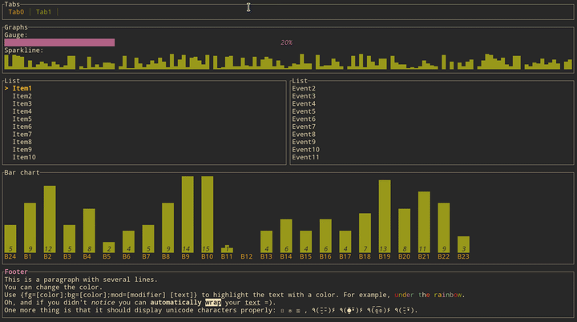

# tui-rs



`tui-rs` is a [Rust](https://www.rust-lang.org) library to build rich terminal
user interfaces and dashboards. It is heavily inspired by the `Javascript`
library [blessed-contrib](https://github.com/yaronn/blessed-contrib) and the
`Go` library [termui](https://github.com/gizak/termui).

The library itself supports two different backends to draw to the terminal. You
can either choose from:

  - [termion](https://github.com/ticki/termion)
  - [rustbox](https://github.com/gchp/rustbox)

However, some features may only be available in one of the two.

The library is based on the principle of immediate rendering with intermediate
buffers. This means that at each new frame you are meant to issue a call for
each widget that is part of the UI. While providing a great flexibility for rich
and interactive UI, this may introduce overhead for highly dynamic content. So, the
implementation try to minimize the number of ansi escapes sequences outputed to
draw the updated UI. In practice, given the speed of rust the overhead rather
comes from the terminal emulator than the library itself.

Moreover, the library does not provide any input handling nor any event system and
you may rely on the previously cited libraries to achieve such features.

## Cargo.toml

```toml
[dependencies]
tui = "0.1"
```

## Get Started

### Create the terminal interface

The first thing to do is to choose from one of the two backends:

For Termion:

```rust
use tui::{Terminal, TermionBackend};

fn main() {
  let backend = TermionBackend::new().unwrap();
  let mut terminal = Terminal::new(backend);
}
```

For Rustbox:

```rust
use tui::{Terminal, RustboxBackend};

fn main() {
  let backend = RustboxBackend::new().unwrap();
  let mut terminal = Terminal::new(backend);
}
```

### Layout

The library comes with a basic yet useful layout management object called
`Group`. As you may see below and in the examples, the library makes heavy use
of the builder pattern to provide full customization. And the `Group` object is
no exception:

```rust
use tui::widgets::{Block, border};
use tui::layout::{Group, Rect, Direction};

fn draw(t: &mut Terminal<TermionBackend>) {

  let size = t.size().unwrap();

  Group::default()
    /// You first choose a main direction for the group
    .direction(Direction::Vertical)
    /// An optional margin
    .margin(1)
    /// The preferred sizes (heights in this case)
    .sizes(&[Size::Fixed(10), Size::Max(20), Size::Min(10)])
    /// The computed (or cached) layout is then available as the second argument
    /// of the closure
    .render(t, &size, |t, chunks| {
        /// Continue to describe your UI there.
        /// Examples:
        Block::default()
          .title("Block")
          .borders(border::ALL)
          .render(t, &chunks[0]);
    })
```

This let you describe responsive terminal UI by nesting groups. You should note
that by default the computed layout tries to fill the available space
completely. So if for any reason you might need a blank space somewhere, try to
pass an additional size to the group and don't use the corresponding area inside
the render method.

Once you have finished to describe the UI, you just need to call:

```rust
t.draw().unwrap()
```

to actually draw to the terminal.

### Widgets

The library comes with the following list of widgets:

  * [Block](examples/block.rs)
  * [Gauge](examples/gauge.rs)
  * [Sparkline](examples/sparkline.rs)
  * [Chart](examples/chart.rs)
  * [BarChart](examples/bar_chart.rs)
  * [List](examples/list.rs)
  * [Table](examples/table.rs)
  * [Paragraph](examples/paragraph.rs)
  * [Canvas (with line, point cloud, map)](examples/canvas.rs)
  * [Tabs](examples/tabs.rs)

Click on each item to get an example.

### Demo

The [source code](examples/demo.rs) of the source gif.

## License

[MIT](LICENSE)

## Author

Florian Dehau
